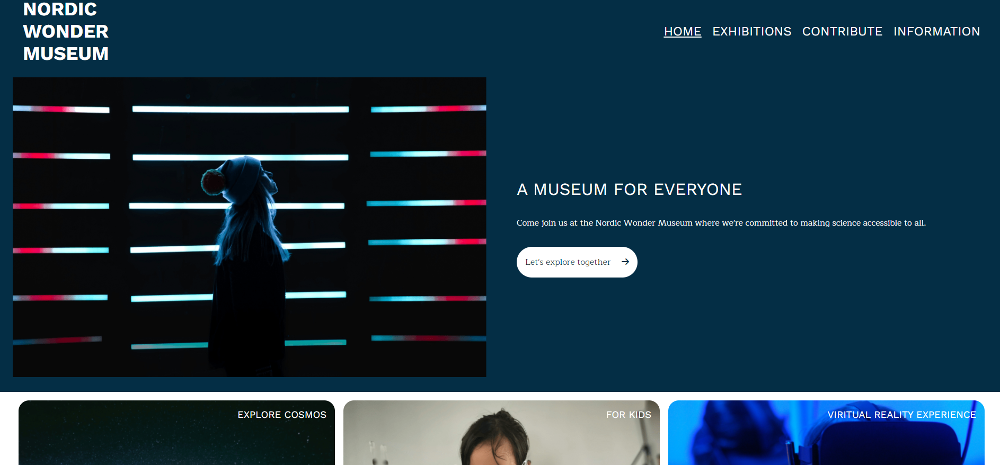

# Nordic Wonder Museum



This is a semester school project.

## Description

This project is a website for a fictional museum created for a school examination. The website uses html and css. The target audience is school children (ages 7-15) and families with young children. The website should give a feel of exitement, joy and curiosity. While at the same time not be too messy and a way for adults to easily find the information they need.

User stories:

- View a home page showing information and impactful imagery
- View a contact page, privacy policy page and a terms and conditions page
- View exhibitions with upcoming events and avaliable exhibitions
- View a contributing page showing information about how to contribute to the museum

## Built With

- HTML
- CSS

## Getting Started

### Installing

The website is hosted live with GithubPages [here](https://maribsorensen.github.io/Semester-Project-1-Mari/). Innstallation and running information bellow.

1. Clone the repo:

```bash
git clone git@github.com:Maribsorensen/Semester-Project-1-Mari.git
```

2. Install the dependencies:

```
npm install
```

### Running

To run the app, run the following commands:

```bash
npm run start
```

## Contact

[My LinkedIn page](https://no.linkedin.com/in/mari-berg-s%C3%B8rensen-b63425156)

